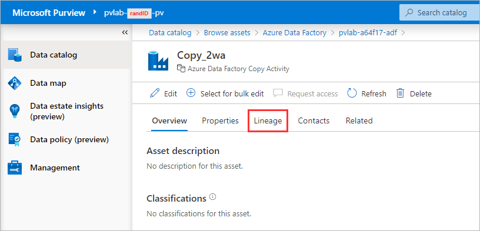
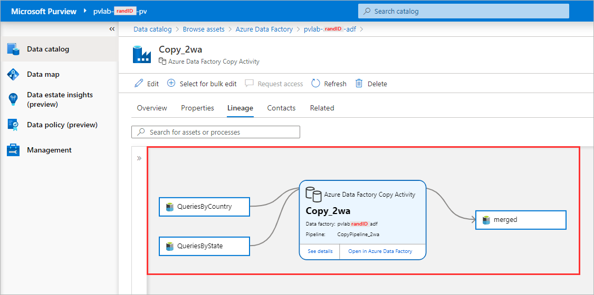

# Module 06 - Lineage

[< Previous Module](../modules/module05.md) - **[Home](../README.md)** - [Next Module >](../modules/module07.md)

## :loudspeaker: Introduction

One of the features of Microsoft Purview is the ability to show the lineage between datasets created by data processes. Data lineage shows how data moves over time and enables you to see how data is used and what changes to data have been made. This visibility helps you to understand, trace back and correct data at the source of origin. Lineage, thus also results into better data quality.

Lineage is typically captured from tools that extract, transform and load data. These ETL tools are, for example, Data Factory, Data Share, and Power BI. They capture the lineage of data as it moves. By scanning these ETL tools you can capture and visualize the lineage in Microsoft Purview.

Microsoft Purview also supports the ability to upload custom lineage. Custom lineage is lineage that you created yourself, for example by uploading metadata using the Microsoft Purview's Atlas REST APIs. Lineage in Purview includes relationships between datasets and processes.

> :bulb: **Did you know?**
>
> * **Dataset**: A dataset (structured or unstructured) provided as an input to a process. For example, a SQL Table, Azure blob, and files (such as .csv and .xml), are all considered datasets. In the lineage section of Purview, datasets are represented by **rectangular boxes**.
>
> * **Process**: An activity or transformation performed on a dataset is called a process. For example, ADF Copy activity, Data Share snapshot and so on. In the lineage section of Purview, processes are represented by **round-edged boxes**.

This module displays lineage from an Azure Data Factory Copy Activity.

## :dart: Objectives

* View Lineage in Microsoft Purview.

## 1. View Lineage in Microsoft Purview

1. Open the **Microsoft Purview Governance Portal**, from the **Data catalog** screen click **Browse**.

    

2. Switch to the **By source type** tab and then select **Azure Data Factory**.

    

3. Select the **Azure Data Factory account instance** (e.g. `pvlab-{randomId}-adf`).

    

4. Select the **Copy Pipeline** and click to open the **Copy Activity**.

    

5. Navigate to the **Lineage** tab.

    

6. You can see the lineage information has been automatically pushed from Azure Data Factory to Purview. On the left are the two sets of files that share a common schema in the source folder, the copy activity sits in the center, and the output file sits on the right.

    

## :tada: Summary

This module provided an overview of how to integrate Microsoft Purview with Azure Data Factory and how relationships between assets and ETL activities can be automatically created at run time, allowing us to visually represent data lineage and trace upstream and downstream dependencies.
